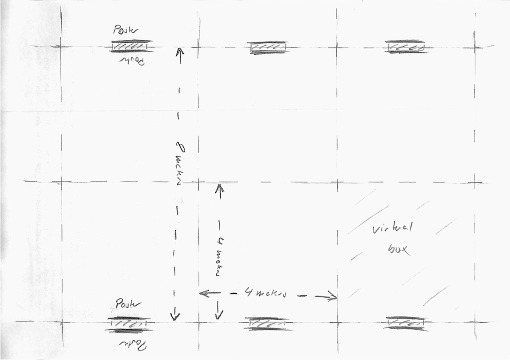
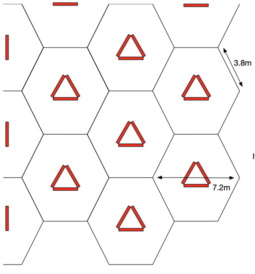

# Local organization - arranging the poster presentations

There are two common ways of organizing poster sessions.
The first, a more frequently used plan, is running large, combined sessions that are typically held in the evening after talk sessions are over.
Usually light dinner and drinks are served during these sessions.
An alternative plan is to run poster sessions parallel to the talk sessions throughout the day.
Both types have been used successfully in the past conferences.
The following guideline, written for the first type of poster sessions, is thanks to Michael Strube, the program co-chair of ACL 2015.
Below this is a more recent experience from ACL 2018 which describes another compelling layout, thanks to Trevor Cohn, local co-chair.

## Tips from ACL 2015

In recent years the poster session at ACLs has become increasingly important.
About half of the papers are presented as posters.
However, the general perception is that a poster presentation is less worth than an oral one.
In order to do away with the "poster stigma" (an expression borrowed from the TACL editors-in-chief), we should organize poster sessions in a way that authors and audience will have the best experience possible.

The following guidelines have been developed by observing the almost perfect poster session at ACL 2014 and evaluated by implementing the guidelines at ACL-IJCNLP 2015.

### Space and Time

Most importantly,

1. It is critical to ensure that sufficient space and time will be allocated for poster presentation.
2. Space and time required are a function of the number of posters and the number of conference attendees.

Recent ACLs had about 200 poster presentations (long and short papers, TACL papers, demos, SRW papers).
These should be split into two poster sessions of about 100 posters, three hours each. The conferences had between 1100 and 1400 attendees.
Hence we had one poster per 10 to 13 attendees per session.

A poster should have enough space to accommodate the presenter and about (at least) five attendees.
Also, attendees should be able to walk through the poster isles and browse posters without bumping into each other.
This requires that each poster occupies a virtual box of about four by four meters, hence each poster requires about 16 square meters (please see the drawing below, artwork by Strube).

For a poster session with 100 posters we need a room of about 1600 sqm.
If food and drinks are served within this room, we need to add another 800 sqm, hence we need about 2400 sqm.
When computing the space, we should also be careful about unusable space.
For example, if there is a stage in the room for oral sessions, this most likely can't be removed but occupies a lot of space, emergency exits may occupy space along the walls.

### Other Considerations

1. Posters have to be arranged by subject area so that attendees easily find the posters they want to explore in detail.
2. Landscape orientation is preferred over portrait, because it allows more attendees to look at one poster simultaneously.
3. An open space between posters allows for easier access to posters and makes a nicer atmosphere. Avoid creating closed isles.
4. A three hour poster session with 100 posters is not the same as two 1 1/2 hour poster sessions with 50 posters each. The poster per attendee ratio changes dramatically. It won't work.
5. Avoid putting events with conflicting setup (oral session, poster session, social event) in the same room, as the time to remove chairs, to set up and remove poster boards may be too long to allow for a smooth schedule.
6. Serve beer during the poster session. Or else, workshop chairs will use the opportunity and make fun of the main conference poster session!
7. Work closely together with the ACL Office as -- in contrast to us -- it knows what it is doing.

## Tips from ACL 2018

In ACL 2018 we had a large room for poster presentations and needed to accomodate many posters, to handle the growing numbers of papers at ACL.
But we shared the poster room with exhibitors and several catering stations.
The 16m2 per poster recommendation from ACL 2015 wasn't going to be possible, nor were long rows of poster boards. The layout ideally allows:

1. Easy access to posters, so they can be viewed from a distance or up close
2. A popular poster shouldn't crowd out nearby posters
3. Easy routes for walking between posters, e.g., when overhearing a conversation nearby, can join in easily
4. Flexibility to incorporate pillars, access doors, catering stations and other odd room shapes
5. Make optimal use of limited floor space

Our solutions was to have many triangles of poster boards, each housing three landscape posters facing outwards.
This means that the viewing area for each poster doesn't impinge on the viewing area for other posters in the group, unlike what happens when they are side-by-side in a row of poster boards.
We arranged each poster triangle so that the points of the triangle were directed towards the face fo posters on neighbouring triangles. (Confused? See sketch below.)
This was so that the crowd around one poster didn't spill into the way of other nearby posters, which often happens when there are narrow rows of posters.

The illustration shows each poster board in red, each of which is 1.4m across, leading to 12m2 space per poster.
The black hexagons are simply guide-lines showing the "virtual box" for each cluster of posters, and from this pattern it's easy to extend the poster area by simply adding additional hexagons.
It does require some geometry, and can be tricky to communicate to the conference venue, but it's worth the effort!
Note that the pattern changes slightly at the walls, and sufficient space is needed to ensure that the wall mounted posters are still accessible.

**Pros/cons.** When you can justify 16m2 per poster, then the ACL15 method above is probably best, so long as you put regular gaps between boards to let people get between corridors.
This has the advantage of allowing people to cruise the posters more quickly, and see if anything piques their interest without feeling compelled to engage.
The triangle layout makes it a bit harder to do this cursory scan.
However it can make more efficient use of smaller rooms, incorporate obstacles (e.g., pillars in middle of triangles), and encourage more engagement with posters, as it is more intimate.
It also supports more natural grouping of clusters of similar papers more coherently, rather than having them in a long line.
It's also easier to spot people in the poster venue, as there are fewer interruptions to sight lines.

