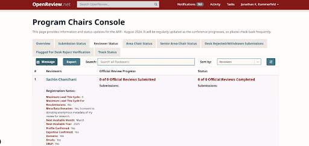

# Technical Open Review Chair

## Introduction

The Technical Open Review Chair (TORC) is a key role within the academic conference management ecosystem, specifically focused on the [OpenReview](https://openreview.net/) platform. This position bridges the gap between the conference organizing committee, program chairs, and the OpenReview development team. By understanding the intricacies of the OpenReview system, the TORC ensures smooth operation and communication during the peer review process, addressing technical issues and facilitating a seamless experience for users.

## Key Responsibilities

### Proceedings Generation
One of the primary responsibilities of the TORC is to assist in generating the conference proceedings using the ACLPUB tool ([source here](https://github.com/acl-org/ACLPUB)). This involves coordinating with program chairs to compile accepted papers and ensuring they are correctly formatted and published.

Explore the information at [acl-org/ACLPUB](https://github.com/acl-org/ACLPUB): The official tool for creating proceedings for conferences of the Association for Computational Linguistics (ACL).

### Communication Facilitation
The TORC plays a crucial role in facilitating communication among stakeholders. This includes:

* Creating and managing groups within the OpenReview platform, such as those needed for specific conference venues.

* Coordinating between various parties to ensure everyone is aligned on the review and submission process.

### Ticket Management
The TORC oversees the Freshdesk ticket management system, which serves as a support mechanism for Open Review users, predominantly editors and program chairs. If faced with issues beyond their purview, the TORC liaises with OpenReview developers, primarily [Jonathan Kummerfeld](http://j.k.kummerfeld@gmail.com/) and Vitor, to resolve problems efficiently.

* Freshdesk (ARR)

* Mailing list

### Workshop Assistance
The TORC plays a crucial role in providing technical support to workshop organizers, ensuring they are proficient in using the OpenReview platform and resolving any related queries. By assisting the workshop organizers, the TORC helps alleviate the workload of OpenReview developers and the main conference chairs, allowing them to focus on higher-level tasks and issues.

[For Conference/Workshop Organizers – ACL Rolling Review](https://aclrollingreview.org/organizers) – A peer review platform for the Association for Computational Linguistics

### FAQ Management
Maintaining a Frequently Asked Questions (FAQ) platform is another essential duty of the TORC. This resource serves as a knowledge base for users to resolve common issues independently, thus streamlining the support process and reducing repetitive queries.

## Recommended Practices

**Advance Requests**: It is recommended to submit OpenReview requests for the commitment site a minimum of three weeks in advance. For example, for ACL 2024 which commitment date was on April 20th, requests should be made by April 1st.

## FAQ

**Q1: At what stages of the reviewing process is the Technical OR Chair most needed?**  
**A1:** The TORC is more involved during the rolling review cycling stage. During the commitment site phase, regular meetings with the OpenReview team may not be necessary, and direct communication with key contacts (Jonathan and Vitor) can suffice for specific issues.

**Q2: How does the TORC contribute to conference venue management on OpenReview?**  
**A2:** The TORC can create and manage new groups within a conference venue on OpenReview, ensuring that all relevant parties have the appropriate access and permissions.

**Q3: What should be done if a technical issue arises that the TORC cannot resolve?**  
**A3:** If the TORC encounters an issue they cannot solve, they are advised to open a ticket on the Freshdesk system and, if necessary, contact the OpenReview developers through the same.

## Tutorial Development:
There is an ongoing effort to develop a comprehensive tutorial that details the role and responsibilities of the TORC, which should be updated annually by the designated TORC individual.

## Setup of the Commitment Site
The OpenReview Co-Chairs are primarily responsible for setting up and maintaining the commitment site. To initiate the process, they should submit a request via the following link. It is recommended to follow the configuration settings used for previous *ACL venues. For further assistance, please contact the ARR technical team or OpenReview support.

* Link to submit a request: [Creating your Venue Instance](https://docs.openreview.net/getting-started/hosting-a-venue-on-openreview/creating-your-venue-instance-submitting-a-venue-request-form)

* The request form created for ACL 2025: (https://drive.google.com/file/d/1DU7DNvflRqxgYmVYZFHW4gmqIs24aw98/view?usp=drive_link)

* OpenReview contact: info@openreview.net ([Contact](https://openreview.net/contact))

**Q4: Why the commitment request form chooses "our venue does not have Ethics Chairs and Reviewers"** 
**A4:** The ethics chairs and reviewers were done within ARR, not within the *ACL commitment site.

**Q5: Other Important Information**
**A5 from Steven Bethard:** You do not need to set up anything on the development server. We did that to test things out before setting it up on the real server because no one provided us with a template for the site, but if you’re following our template, practicing on the development server is probably unnecessary since you’re unlikely to change much. In short, you can probably ignore mentions of the development server and everything after “If you copy anything”.

## Handle Program Chair requests using the Program Chairs Console and Python API
Program Chairs Console

You may write messages about reviewers with 0 assignments

Python API to (Help PCs)
* Send the emails
* Show distribution of scores, per area break down
* Add a batch of reviewers

[Code repository](https://github.com/acl-org/arr-openreview/blob/main/v2/v2_sae_assignments.py) (version 1)
Version 2 was released in April 2024 and only v2 would be used.

## Managing Communication between OpenReview, ACL PCs, ARR editors and ARR technical co-chairs

Co-chairs need support from OpenReview to complete the following tasks:

* Add extra options in the PC console

* Keep track of all new features

During Review period

* No access

* Need to look back multiple cycles

**Q: If the deadline has passed, how to avoid double submissions?** 
**A:** The deadline passes, sending a list of papers (titles and abstracts) committed to ARR technical co-directors, overlapped with submissions.

## Additional information:

* [openreview/openreview-py](https://github.com/openreview/openreview-py)): Official Python client library for the OpenReview API

* [ARR Dashboard](https://stats.aclrollingreview.org/iterations/2024/june/) provides an overview of submissions.

* [OpenReview Python Client Documentation](https://openreview-py.readthedocs.io/en/latest/) — OpenReview Python Client 0.0.1 documentation provides technical details to solve problems with Python, if the PC console does not provide the corresponding functionalities.
